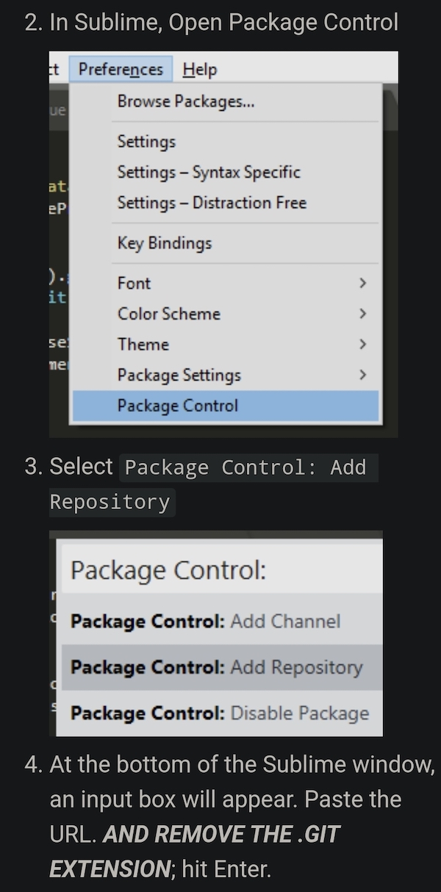

Gõ tiếng Việt thông minh trên Sublime Text. Nhấn phím `esc` để bật tắt chế độ gõ tiếng Việt.
https://user-images.githubusercontent.com/8133/189085556-2d5768fb-dda0-424d-9d41-1de51449a565.mp4

Cài đặt thông thường:


Add `https://github.com/telexyz/fingers-sublime.git`

Sau đó vào `Package Control: Install Package` và tìm `fingers-sublime` và cài đặt.

### Một số phím tắt cài sẵn: 

- `command+shift` hoặc `windows+shift` để tắt / bật chết độ gõ.

- Lựa chọn đoạn text tiếng Anh rồi `command+esc` hoặc `windows+esc` để dịch google.

- - -

Cài đặt locally để phát triển:
```
git clone https://github.com/telexyz/fingers-sublime.git
ln -s ~/repos/fingers-sublime ~/Library/Application\ Support/Sublime\ Text/Packages/fingers-sublime
```
## DOING

- Khi viết code chỉ gõ dc TV trong comment và string.

## DONE

- Hover để tra từ điển Anh - Việt | tham khảo https://github.com/futureprogrammer360/Dictionary

- Hiển thị nguyên gốc, TV hiển thị ở popup, nhấn `space` tự động chọn TV, `tab` bỏ qua

- `eeq`=>`ê` để sửa sai nhanh khi gõ theo thói quen cũ `ee`=>`ê`, tương tự cho oo, aa

- Dùng `q` để bỏ dấu `ô ê â` => handle `moon teen boong` well

- Tìm cách bind zig code vào python
  https://github.com/gwenzek/fastBPE/blob/master/test/test_zig.py
